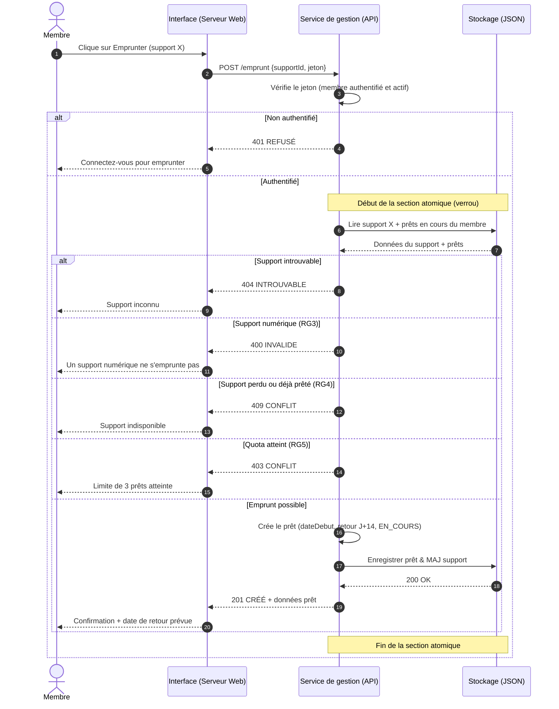

# Tiers données

```mermaid
sequenceDiagram
    autonumber
    actor M as Membre
    participant I as Interface (Serveur Web)
    participant S as Service de gestion (API)
    participant B as Stockage (JSON)

    M->>I: Clique sur Emprunter (support X)
    I->>S: POST /emprunt {supportId, jeton}
    
    S->>S: Vérifie le jeton (membre authentifié et actif)
    
    alt Non authentifié
        S-->>I: 401 REFUSÉ
        I-->>M: Connectez-vous pour emprunter
    else Authentifié
        Note over S,B: Début de la section atomique (verrou)
        S->>B: Lire support X + prêts en cours du membre
        B-->>S: Données du support + prêts
        
        alt Support introuvable
            S-->>I: 404 INTROUVABLE
            I-->>M: Support inconnu
        else Support numérique (RG3)
            S-->>I: 400 INVALIDE
            I-->>M: Un support numérique ne s'emprunte pas
        else Support perdu ou déjà prêté (RG4)
            S-->>I: 409 CONFLIT
            I-->>M: Support indisponible
        else Quota atteint (RG5)
            S-->>I: 403 CONFLIT
            I-->>M: Limite de 3 prêts atteinte
        else Emprunt possible
            S->>S: Crée le prêt (dateDebut, retour J+14, EN_COURS)
            S->>B: Enregistrer prêt & MAJ support
            B-->>S: 200 OK
            S-->>I: 201 CRÉÉ + données prêt
            I-->>M: Confirmation + date de retour prévue
        end
        Note over S,B: Fin de la section atomique
    end
```